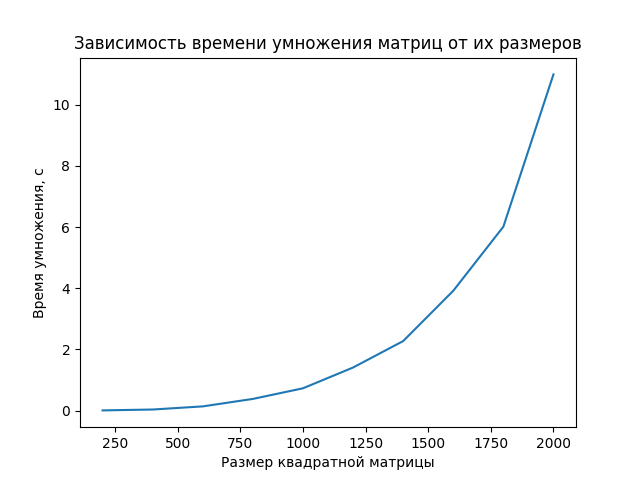
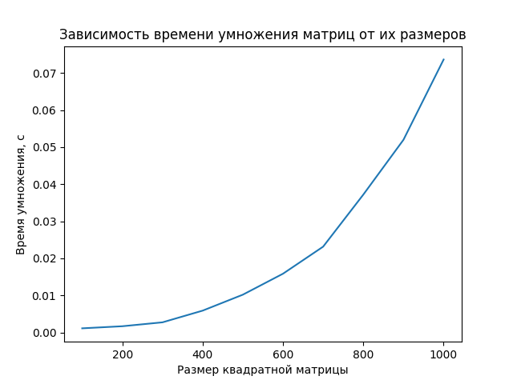
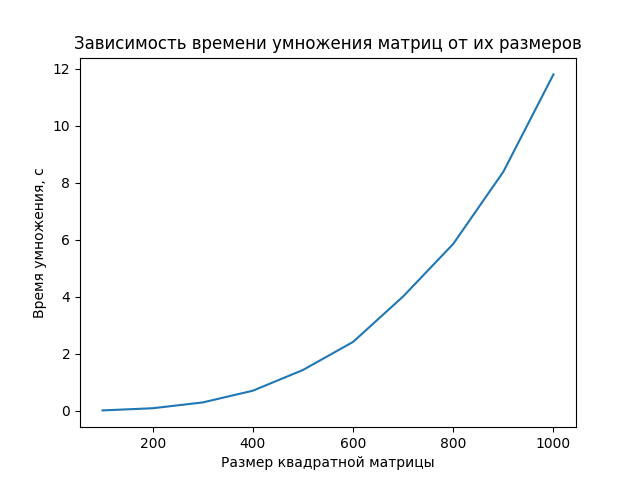

# Отчет по лабораторной работе №1

## Задание 
Модифицировать программу из л/р №1 для параллельной работы по технологии OpenMP.

## Изменения
В `MatrixMultiplicator` умножение матриц теперь распараллелено по внешнему циклу директивой `omp parallel for schedule(static)`.
Таким образом, потоки будут выполнять вычисления для разных строк одновременно. Выбрано именно `schedule(static)`, т.к. итерации занимают примерно одинаковое время. Также оптимизирован `CMake`. Использовалось 12 потоков, т.к. программа выполнялась на 12ядерном процессоре.

## Результат
График, полученный ранее для последовательной программы:

График, полученный для текущей программы:

График для более больших размеров матриц:

## Вывод
Операция умножения матриц имеет сложность *O(n^3)*, по графику все еще наблюдается нечто похожее, однако при сравнении с ранее полученными результатами можно сделать вывод: для распараллеленой программы этой оценкой сложности все же является *O(αn^3)*, где  α - некий коэфиициент, при чем  α<<1. Скорость вычислений возросла в более чем **150 раз**. 