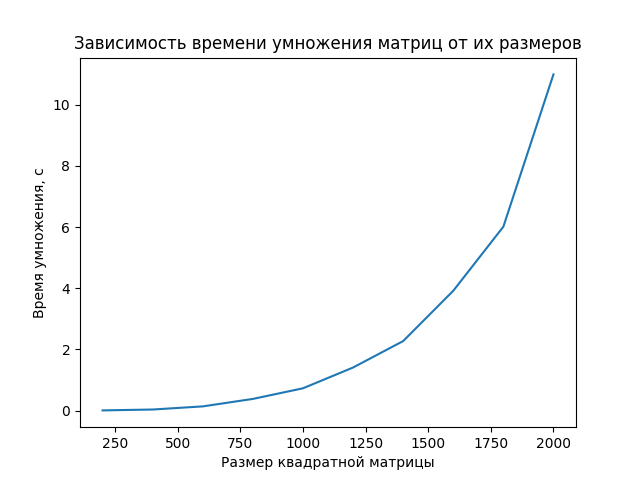
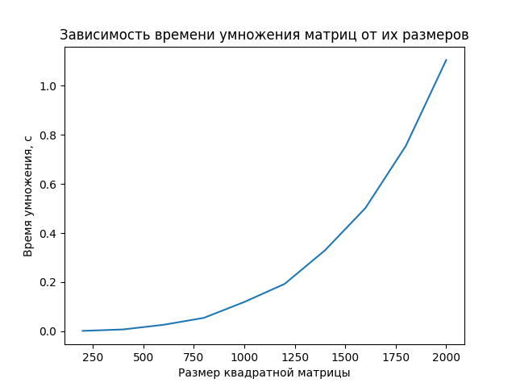
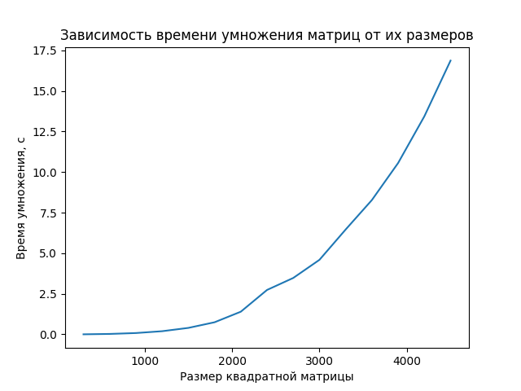

# Отчет по лабораторной работе №3

## Изменения 
Теперь в `main.cpp` инициализируется `MPI`. С его помощью каждый процесс получает часть первой матрицы и вторую матрицу полностью. Матрицы передаются в виже одномерного массива, чтобы минимизировать расходы на их передачу. Также оптимизирован `CMake`. Использовалось 12 процессов, т.к. программа выполнялась на 12-ядерном процессоре.

## Результат

| Технология | График |
|------------|--------|
| Последовательная программа |  |
| OpenMP |  |
| MPI |  |

Для больших размеров:

| OpenMP | MPI |
|-------|------|
|  |  |

## Вывод
По сравнению с изначальной последовательной программой время выполнения сократилось примерно до 10%, что касается `OpenMP`, на небольших размерах есть лишь небольшой прирост скорости, однако при их увеличении разница ощутима в пользу `MPI`.