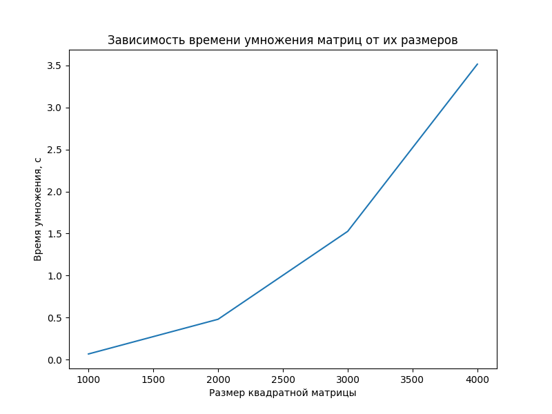
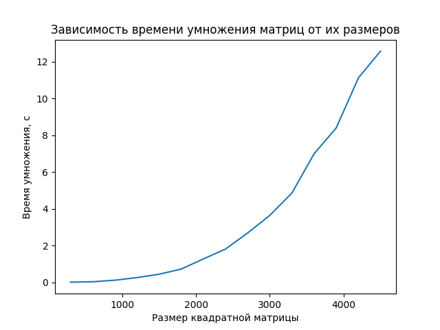

# Отчет по запуску лабораторной работы №3 на суперкомпьютере "Сергей Королев"

## Изменения 
1) Сборка производится вручную, `CMake` больше не требуется
2) Нет необходимости обмениваться данными через файл, написан генератор матриц `matrixGen.cpp`, результат выводится в консоль
3) Специфичные изменения для запуска на кластере

## Ход работы
1) Подключился к кластеру через PuTTy и WinSCP для удобства работы с файлами

| PuTTy | WinSCP |
|-------|------|
|  |  |

2) Перенес все необходимые файлы

3) Скомпилировал все исходные файлы в один командой `mpicxx -std=c++11 -O3 -ffast-math main.cpp -o main`, предварительно подключим `MPI` - `module load intel/mpi4`

4) Написал скрипт для постановки задачи в планировщик 'Slurm'

5) Далее командой `sbatch script.pbs` ставил задачу в очередь по мере необходимости проверяя ее статус при помощи `squeue -u`

6) Повторял пункт **5** изменяя количество процессов и размеры матриц

## Результаты
Результирующая таблица с ключевыми значениями размеров
|Размер\Ядра | 4 | 8 | 12 | 20 |
|------------|---|---|----|----|
|1000 | 0.208654 | 0.116865 | 0.113855 | 0.0664519|
|2000 | 1.44783 | 0.810939 | 0.607042  | 0.479519 |
|3000 | 4.62493 | 2.5512   | 1.86891 | 1.52621 |
|4000 | 10.8048 |  5.89139 | 4.42565 | 3.51567 |

[Интерактивная 3D-диаграмма](3d_plot.html)

Сравнение на 12 процессах с моим ноутбуком:
|СК Королев | 12th Gen Intel(R) Core TM i7-1255u |
|------------|---|
| |  |

Что касается больших размеров

## Вывод
По проведенным исследованиям видно, что СК "Королев" значительно ускоряет вычисления - приблизительно в 4 раза по сравнению с моим устройтсвом, и в целых 20 раз для последовательной программы.